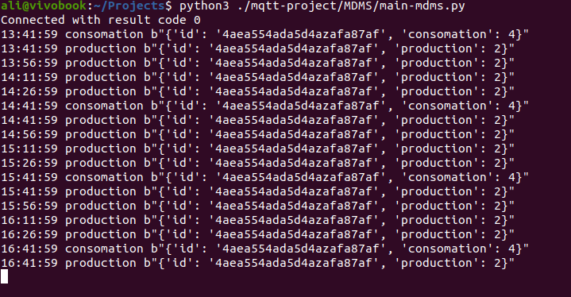
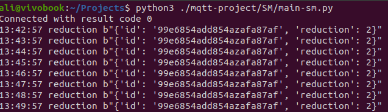
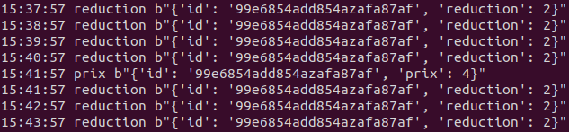
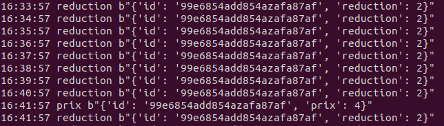
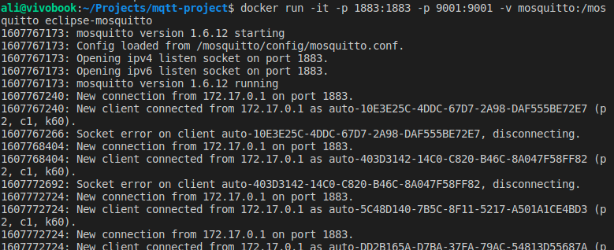

# Rapport MQTT IOT 
Ce rapport est préparé par **Ali HAMOUDA**

Le but de la manipulation est d'implémenter deux clients qui communique via un broker de protocole MQTT.

J'ai choisi le broker **eclipse-mosquitto**.
Les clients sont implémentés en **Python**.
Le broker ainsi que les clients peuvent être mis en marche à partir de **Docker** ou directement.

## Requirement
Il faut installer l'API de **Mosquitto** pour Python en éxecutant:

```
$ pip3 install paho-mqtt
```

Pour linux, on peut installer **make** qui execute les commandes à partir de **Makefile**.

## Besoin
Nous avons besoin de deux clients: **SM** et **MDMS**.
Ces deux clients publient et souscrient sur des topics comme ci-dessous:

Emetteur | Topic | Frequence | Payload |QOS
--       |---    |--         |-- |--
SM |consomation|1 / 60 min|JSON {ID,consomation}|2
SM|production|1 / 15 min|JSON {ID,production}|2
MDMS |prix|1 / 60 min|JSON {ID,prix}|0
MDMS|reduction|1 / 1 min|JSON {ID,reduction}|2

ID représente lidentifiant de l'émetteur.

## Implémentation
J'ai créé une classe **Client** pour chaque client.

```python
# Definition de la classe client pour SM
class SMClient (mqtt.Client):

# Definition de la classe client pour MDMS
class MDMSClient (mqtt.Client):
```

Chaque classe contient des methodes convenables:
```python
# Methodes communes
    def __init__(self):
    def connect(self):
    @staticmethod
    def on_connect(client, userdata, flags, rc):
    @staticmethod
    def on_message(client, userdata, msg):

    # Pour assurer l'écoute en permanence
    def connect_and_listen_forever(self):

# Methodes spécifiques au MDMS
    def publish_prix(self,prix=4):
    def publish_reduction(self, reduction=2):

# Methodes spécifiques au SM
    def publish_consommation(self,consomation=4):
    def publish_production(self, production=2):
```

La methode **__init__** d'initialisation:
```python
    self.id="any-id"
    #Initialisation du client MQTT
    self.client = mqtt.Client()

    #ON_CONNECT s'execute à la connection au broker    
    self.client.on_connect = self.on_connect

    #ON_MESSAGE s'execute à chaque message reçu  
    self.client.on_message = self.on_message
```

Les methodes de **publish** sont simplement écrit en utilisant l'API:
```python
    def publish_XYZ(self, PAYLOAD):
        self.client.publish("TOPIC NAME",qos=QOS_VALUE,payload=PAYLOAD)

        # Pour executer l'envoie chaque une période de temps
        # On appelle la methode par un Timer
        threading.Timer(TEMPS_DATTENTE, self.publish_XYZ).start()
```
## Les étapes d'execution

J'ai démaré un broker à partir d'une image **DOCKER**

```
$ docker run -it -p 1883:1883 -p 9001:9001 -v ./vol:/mosquitto/ eclipse-mosquitto
```

J'ai ensuite executé les fichiers main-xyz.py de python
```shell
$ python3 ./SM/main-sm.py

# Dans un autre terminal
$ python3 ./MDMS/main-mdms.py
```

## Preuves d'execution

MDMS en marche et reçoit les messages en respect des conditions:



SM en marche et reçoit les messages en respect des conditions:






Broker en marche:

